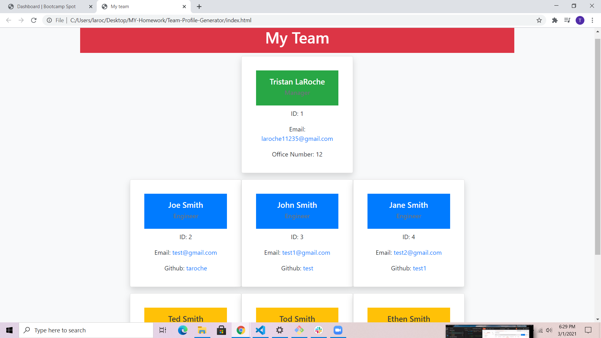

# Team-Profile-Generator

  
  ## License

  
  
  
  ## Description 
  
  *The what, why, and how:* 
  
  This is a node.js program that lets you generate your team. When you run the the program it will ask you for your name, id number, and email and role. Then based on the role you selecled it will then ask you a question spefic to the role you selecled. If you are the manager it will ask for your office number, if you selecled engineer it will ask for a github account, and if you selecled intern it will ask for the school they go to. After that question it will ask if you would like to add another employee. If you selecl yes it will go through all the questions again. But it will only allow you to selecl manager for the role once as soon as you pick it the next time you run through the question it will have removed that oppion from the roles. You can add as many employees as you would like. When you have added all the emplyees you need and press the no oppsion it will then take all the emplyees that you have added and generate a html file with all this information in.

  
  ## Table of Contents
  
  * [Installation](#installation)
  * [Usage](#usage)
  * [Questions](#questions)
  * [Image](#image)
  * [Video](#Video)

  
    
  ## Installation
  
  *Steps required to install project and how to get the development environment running:*
  
  First clone the repo from git. Then run in the command line npm install. The type node app.js in the terminal.

  ## Usage

  Just anwser the questions. You can also type npm run test and it will run a test using npm jest.

  ## Questions
  
  This is how you can get a hold of me either at my Github account or by email.
  
  GiuHub username: [taroche](https://www.github.com/taroche)
  
  Email: [laroche11235@gmail.com](mailto:laroche11235@gmail.com)

  ## Image

  

  ## Video

  [The video of me using this app](https://drive.google.com/file/d/1LarKl-9wVN3aQSfbVkmydyHcoiOTaK4e/view)